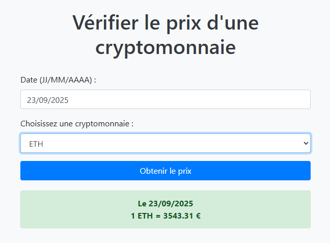

# PriceLedger 🚀



[](LICENSE)
[](https://www.python.org/)
[](https://www.gnu.org/software/bash/)

**PriceLedger** permet de consulter le prix historique du **Bitcoin (BTC)** ou de **l’Ethereum (ETH)** à une date donnée.
Deux modes d’utilisation : **CLI terminal** ou **interface web**.

---

## 🔹 Fonctionnalités

* Vérification des prix historiques BTC/ETH à une date précise
* Conversion automatique des dates en **timestamp Unix** pour l’API CryptoCompare
* Retour d’erreur clair si aucune donnée n’est trouvée
* Deux interfaces disponibles :

| Mode         | Description       | Avantages                                          |
| ------------ | ----------------- | -------------------------------------------------- |
| **Terminal** | CLI Bash          | Rapide, léger, idéal pour les utilisateurs avancés |
| **Web**      | Interface HTML/JS | Ergonomique, interactive, visuelle                 |

---

## 🗂 Structure du projet

```
PriceLedger/
├── cli/                             # Version terminal Bash
│   └── crypto_price_checker.sh      # CLI pour consulter le prix historique
├── images/                          # Dossier pour les images
│   └── web_preview.png              # Capture d’écran de l’interface web
├── LICENSE                          # Fichier de licence MIT
├── README.md                        # Documentation
├── run.sh                           # Script racine pour lancer CLI ou serveur web
└── web/                             # Interface web
    ├── index.html                   # Page HTML principale
    ├── script.js                    # JavaScript pour interroger l’API
    └── start-web-server.sh          # Script pour démarrer le serveur web local
```

> `run.sh` permet de lancer **la CLI par défaut** ou le **serveur web**, très simplement.

---

## ⚙️ Prérequis

* **Python 3** (pour le serveur web)
* **curl** et **jq** (pour le CLI Bash)
* Navigateur web moderne (pour l’interface web)

---

## 🚀 Installation et utilisation rapide

### Cloner et lancer le projet

```bash
git clone https://github.com/medaey/PriceLedger.git
cd PriceLedger/
chmod +x run.sh
./run.sh -d 01/01/2023 -e BTC   # lance la version terminal avec date et crypto
```

Pour lancer le serveur web :

```bash
./run.sh web
```

---

### Optionnel : lancer directement les scripts

#### Terminal CLI

```bash
chmod +x cli/crypto_price_checker.sh
./cli/crypto_price_checker.sh -d 01/01/2023 -e BTC
```

#### Serveur web

```bash
chmod +x web/start-web-server.sh
./web/start-web-server.sh
```

Puis ouvrir le navigateur à l’adresse :

```
http://localhost:8000
```

---

## 🔗 API utilisée

* [CryptoCompare API](https://www.cryptocompare.com/)

---

## 📌 Notes importantes

* Format de date : **JJ/MM/AAAA**
* Le serveur web est nécessaire pour éviter les problèmes de **CORS**
* Si aucune donnée n’est disponible, un message d’erreur s’affiche

---

## 📝 License

MIT License © 2025 Médéric Cossu
Le logiciel est fourni "tel quel", sans aucune garantie. Voir `LICENSE` pour plus de détails.